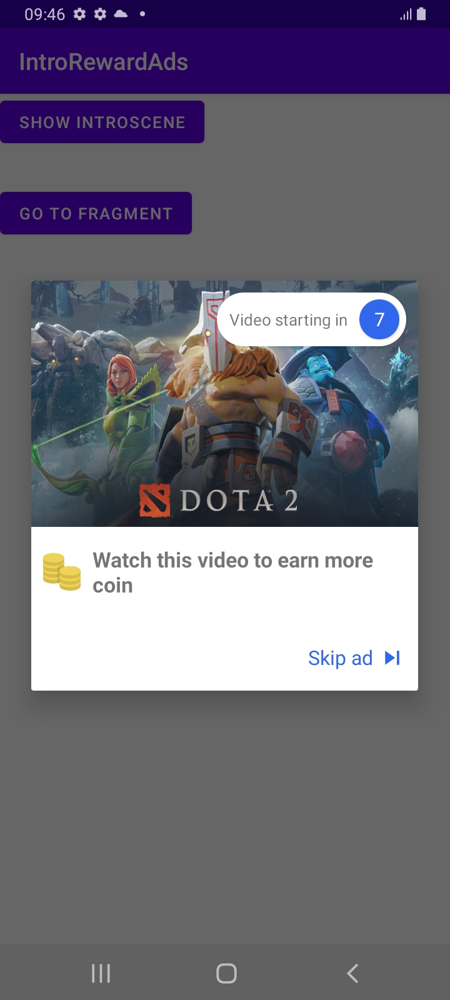

`RewardInterstitiaAds IntroScene` is an easy IntroScene UI implement library for `Android`.

Screenshot
---



How do I use it?
---

### Setup

## Prerequisites
[](https://jitpack.io/#dangnhat99/Android-IntroScene-RewardedInterstitialAds)
Add this in your root `build.gradle` file (**not** your module `build.gradle` file):

```gradle
allprojects {
	repositories {
		...
		maven { url "https://jitpack.io" }
	}
}
```


##### Dependencies
Add this to your module's `build.gradle` file (make sure the version matches the JitPack badge above):
```groovy
dependencies {
   implementation 'com.github.dangnhat99:Android-IntroScene-RewardedInterstitialAds:Tag'
}
```

### Functions

**In activity**

```java
            //show intro scene
            IntroSceneRewardedAdsFragment introSceneRewardedAdsFragment = new IntroSceneRewardedAdsFragment(new IntroSceneRewardedAdsFragment.IntroSceneCallback() {
                @Override
                public void onAdDismiss() {
                    Log.d("TAG", "onAdDismiss: ");
                }

                @Override
                public void onCountDownFinish() {
                    //TODO show rewarded interstitial ads
                }
            });
	    
	    introSceneRewardedAdsFragment.setDrawable(ContextCompat.getDrawable(this,R.drawable.dota2_social));
            introSceneRewardedAdsFragment.setTextTitle("Watch this video to earn more coin");
            introSceneRewardedAdsFragment.setTimeCountDown(10); //time in second

            introSceneRewardedAdsFragment.show(getSupportFragmentManager(), "YOUR_TAG");
```


**In fragment**  
```java
// from View
       //show intro scene
        IntroSceneRewardedAdsFragment introSceneRewardedAdsFragment = new IntroSceneRewardedAdsFragment(new IntroSceneRewardedAdsFragment.IntroSceneCallback() {
            @Override
            public void onAdDismiss() {
                Log.d("TAG", "onAdDismiss: ");
            }

            @Override
            public void onCountDownFinish() {
                //TODO show rewarded interstitial ads
            }
        });

        introSceneRewardedAdsFragment.setDrawable(ContextCompat.getDrawable(getContext(),R.drawable.dota2_social));
        introSceneRewardedAdsFragment.setTextTitle("Watch this video to earn more coin");
        introSceneRewardedAdsFragment.setTimeCountDown(10); //time in second

        introSceneRewardedAdsFragment.show(getChildFragmentManager(), "YOUR_TAG");
```

**IntroScene Options**

- setDrawable(Drawable drawable)
- setTextTitle(String textTitle)
- setTextVideoIn(String textVideoIn)
- setTimeCountDown(int timeCountDown) //second


Developed By
-------
Dmnhat 
